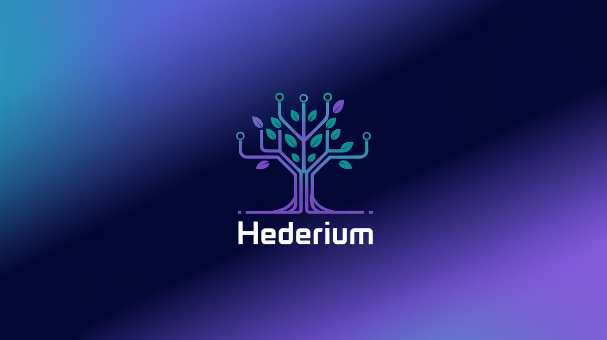

# Hederium

<p align="center">
  
</p>

[](https://github.com/LimeChain/Hederium/actions/workflows/unit-test.yml)
[](https://github.com/LimeChain/Hederium/actions/workflows/dev-tool-test.yml)
[](LICENSE)
[](https://golang.org/)

Hederium is designed to implement the Hashio protocol in Go, offering high performance, reliability, and scalability. This implementation follows Go best practices and provides a comprehensive suite of features for building distributed applications.

## Prerequisites

- Go 1.20 or higher
- Docker (for containerized deployment)
- Git

## Documentation

- [Configuration](docs/configuration.md)
- [RPC API](docs/rpc-api.md)
- [Benchmark](docs/benchmark.md)

## Installation

1. Clone the repository:

   ```bash
   git clone https://github.com/LimeChain/Hederium.git
   cd Hederium
   ```

2. Install dependencies:
   ```bash
   go mod download
   ```

## Building and Running

### Local Development

```bash
go run ./cmd/server/main.go
```

### Using Docker

```bash
docker build -t hederium .
docker run hederium
```

## Testing

Run the unit tests:

```bash
go test ./... -v
```

## Project Structure

- `/cmd` - Main applications
- `/internal` - Private application and library code
- `/configs` - Configuration files
- `/test` - Additional external test applications and test data
- `/tools` - Example tools for testing and development
- `/docs` - Design and user documents

## Contributing

1. Fork the repository
2. Create your feature branch (`git checkout -b feature/amazing-feature`)
3. Commit your changes (`git commit -m 'Add some amazing feature'`)
4. Push to the branch (`git push origin feature/amazing-feature`)
5. Open a Pull Request

## License

This project is licensed under the terms of the LICENSE file included in the repository.

## Contact

Project Link: [https://github.com/LimeChain/Hederium](https://github.com/LimeChain/Hederium)
